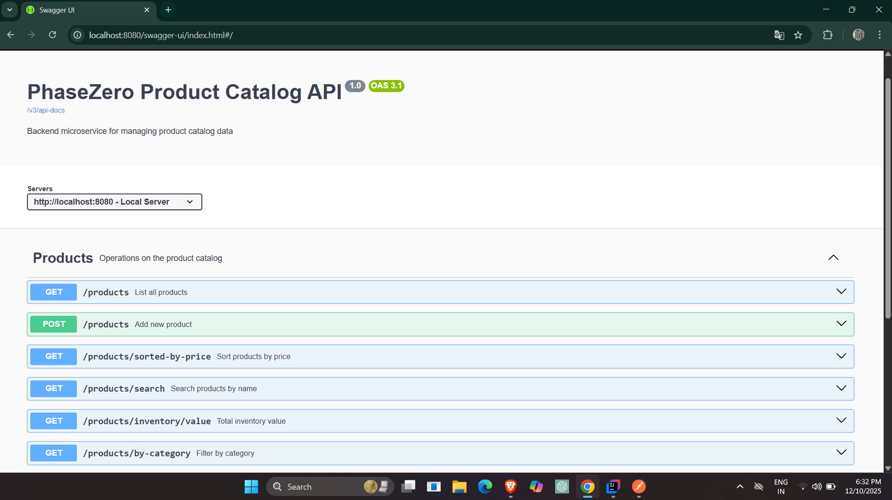
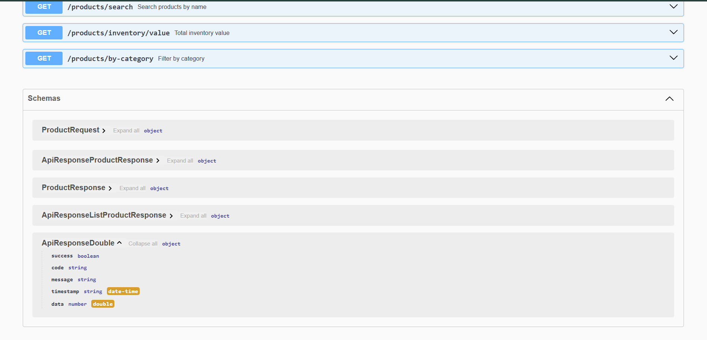

# PhaseZero Catalog Service API
A backend microservice built using **Spring Boot**  and **Java 17**  that manages a product catalogue and exposes REST APIs for product operations such as add, search, filter, sort, pagination, and inventory value calculation.
This project follows best practices in API design, data modeling, validation, error handling, and caching.

This project is developed as part of the **PHASEZERO Backend Java Practical Assignment**.

---
## Base URL

```text
http://localhost:8080
```
## Swagger UI (API documentation & testing)
```text
http://localhost:8080/swagger-ui/index.html
```
---

## 🚀 Tech Stack

- Java 17
- Spring Boot
- Spring Web
- Spring Data JPA
- H2 In-Memory Database
- Spring Validation
- Spring Cache
- Spring Actuator
- Swagger (OpenAPI)
- Docker & Docker Compose
- Maven
- SonarQube (Static Code Analysis)
- Lombok
- SLF4J Logging

---
---
## 🏗️ Project Architecture
````
src/main/java/com/phasezero/catalog
│
├── controller        # REST endpoints
├── service           # Business logic
│   └── impl          # Service implementations
├── repository        # JPA repositories
├── model             # JPA entities
├── dto               # Request/Response DTOs
├── mapper            # Entity ↔ DTO transformation
├── exception         # Custom exceptions
├── util              # String normalization utilities
└── config            # Application config (cache, swagger, etc.)

````
---
## 🧱 3-Tier Architecture (Layered Design)

The project follows a clean, maintainable **3-tier architecture**, ensuring clear separation of concerns and easy scalability.


````
┌─────────────────────────────────────┐
│     Controller Layer                │  ← HTTP Request/Response handling
│  (ProductController)                │
└──────────────┬──────────────────────┘
               │
┌──────────────▼──────────────────────┐
│     Service Layer                   │  ← Business logic & validation
│  (ProductService)                   │
└──────────────┬──────────────────────┘
               │
┌──────────────▼──────────────────────┐
│     Repository Layer                │  ← Data access
│  (ProductRepository)                │
└──────────────┬──────────────────────┘
               │
┌──────────────▼──────────────────────┐
│     Database (H2)                   │  ← In-memory storage
└─────────────────────────────────────┘
````
---

## ✅ Features Implemented

- Add Product with validation
- List All Products
- Search Products by Name (case-insensitive)
- Filter Products by Category
- Sort Products by Price (Ascending)
- Pagination Support
- Calculate Total Inventory Value
- Global Exception Handling
- Swagger API Documentation
- Caching Implementation
- Dockerized Deployment
- SonarQube Verified Code Quality
---

## 📦 Product Data Model

| Field Name  | Type   | Description |
|------------|--------|-------------|
| id         | Long   | Auto-generated primary key |
| partNumber | String | Unique business identifier |
| partName   | String | Product name (stored in lowercase) |
| category   | String | Product category |
| price      | double | Unit price (non-negative) |
| stock      | int    | Inventory quantity (non-negative) |
| createdAt | LocalDateTime | Product creation timestamp |

---
### 📡 API Overview
| Method | Endpoint                    | Description                   |
| ------ | --------------------------- | ----------------------------- |
| GET    | `/products`                 | List all products (paginated) |
| POST   | `/products`                 | Add a new product             |
| GET    | `/products/sorted-by-price` | Sort by price ascending       |
| GET    | `/products/search`          | Search by partName            |
| GET    | `/products/by-category`     | Filter by category            |
| GET    | `/products/inventory/value` | Total inventory value         |
---
## 📜 Business Rules Enforced

- `partName` is automatically stored in **lowercase**
- `partNumber` must be **unique**
- `price` and `stock` **cannot be negative**
- All validations are enforced at **API level**
- Proper HTTP status codes returned:
    - `400 Bad Request`
    - `409 Conflict`

---

## 🚀 Running the Application (Local)
### 1. Build the project

### Clean the application
```bash
      mvn clean package
```
### Run the application
```bash
    mvn spring-boot:run
```
### The application will start at:
```text
    http://localhost:8080
```

## 🐳 Running with Docker (Recommended)
### Build & run with Docker Compose
```bash
    docker compose up --build
```
### Stop the container
```bash
    docker compose down
 ```
## 🗄️ H2 Database Console
### Open the H2 Console at:
```bash
  http://localhost:8080/h2-console
```
### Example JDBC URL
```bash
  jdbc:h2:mem:catalogdb
```
## 📖 Swagger API Documentation
### After running the application, open:
```bash
    http://localhost:8080/swagger-ui/index.html
```
---


---
## 🧪 API Testing (Real Postman Examples)
This section contains actual request & response outputs captured during Postman testing.
### 🚀 1️⃣ POST /products — Create Product
✔ 1.1 Successful Product Creation
```Request
{
"partNumber": "PN-3010",
"partName": "brake pad",
"category": "brakes",
"price": 55.0,
"stock": 25
}
```
```Response

{
"success": true,
"code": "CREATED",
"message": "Resource created",
"timestamp": "2025-12-10T19:52:06.506025600Z",
"data": {
"id": 3,
"partNumber": "PN-3010",
"partName": "brake pad",
"category": "brakes",
"price": 55.0,
"stock": 25
}
}
```
### ❌ 1.2 Duplicate Product

```Response

{
"timestamp": "2025-12-11T01:22:52.0682421",
"status": 409,
"error": "Conflict",
"message": "Product with partNumber 'PN-3010' already exists",
"code": "PRODUCT_DUPLICATE",
"path": "/products",
"details": null
}
```

### ❌ 1.3 Validation Error – Missing Fields

``` Request

{
"partNumber": "",
"partName": "",
"category": "filters",
"price": 100,
"stock": 5
}
```

```Response

{
"timestamp": "2025-12-11T01:25:02.9956375",
"status": 400,
"error": "Bad Request",
"message": "Validation failed",
"code": "VALIDATION_ERROR",
"path": "/products",
"details": [
{
"field": "partNumber",
"message": "partNumber is required"
},
{
"field": "partName",
"message": "partName is required"
}
]
}
```
### ❌ 1.4 Validation Error – Negative Price

```Request

{
"partNumber": "PN-3011",
"partName": "brake pad",
"category": "brakes",
"price": -55.00,
"stock": 25
}
```

```Response

{
"timestamp": "2025-12-11T01:29:27.6132922",
"status": 400,
"error": "Bad Request",
"message": "Validation failed",
"code": "VALIDATION_ERROR",
"path": "/products",
"details": [
{
"field": "price",
"message": "price cannot be negative"
}
]
}
```
### ❌ 1.5 Validation Error – Negative Stock

``` Request

{
"partNumber": "PN-3011",
"partName": "brake pad",
"category": "brakes",
"price": 55.00,
"stock": -25
}
```

``` Response

{
"timestamp": "2025-12-11T01:29:57.9687896",
"status": 400,
"error": "Bad Request",
"message": "Validation failed",
"code": "VALIDATION_ERROR",
"path": "/products",
"details": [
{
"field": "stock",
"message": "stock cannot be negative"
}
]
}
```
## 📌 2️⃣ GET /products — List All Products
### ✔ 2.1 Without Pagination

```Response

{
"success": true,
"code": "OK",
"message": "Request successful",
"timestamp": "2025-12-10T20:03:49.530732800Z",
"data": [
{
"id": 1,
"partNumber": "PN-1001",
"partName": "hydraulic filter",
"category": "filters",
"price": 12.5,
"stock": 100
},
{
"id": 2,
"partNumber": "PN-2003",
"partName": "oil seal",
"category": "seals",
"price": 8.75,
"stock": 40
},
{
"id": 3,
"partNumber": "PN-3010",
"partName": "brake pad",
"category": "brakes",
"price": 55.0,
"stock": 25
}
]
}
```
### ✔ 2.2 With Pagination

```URL :-http://localhost:8080/products?page=0&size=10```

```Response

{
"success": true,
"code": "OK",
"message": "Request successful",
"timestamp": "2025-12-10T20:03:49.530732800Z",
"data": [
{
"id": 1,
"partNumber": "PN-1001",
"partName": "hydraulic filter",
"category": "filters",
"price": 12.5,
"stock": 100
},
{
"id": 2,
"partNumber": "PN-2003",
"partName": "oil seal",
"category": "seals",
"price": 8.75,
"stock": 40
},
{
"id": 3,
"partNumber": "PN-3010",
"partName": "brake pad",
"category": "brakes",
"price": 55.0,
"stock": 25
}
]
}
```

### 📌 3️⃣ GET /products/search — Search by Name
### ✔ Example ("brake")

```Response

{
"success": true,
"code": "OK",
"message": "Request successful",
"timestamp": "2025-12-10T20:05:39.125712600Z",
"data": [
{
"id": 3,
"partNumber": "PN-3010",
"partName": "brake pad",
"category": "brakes",
"price": 55.0,
"stock": 25
}
]
}
```
### 📌 4️⃣ GET /products/sorted-by-price — Price ASC

``` Response
{
"success": true,
"code": "OK",
"message": "Request successful",
"timestamp": "2025-12-10T20:20:15.500306800Z",
"data": [
{
"id": 2,
"partNumber": "PN-2003",
"partName": "oil seal",
"category": "seals",
"price": 8.75,
"stock": 40
},
{
"id": 1,
"partNumber": "PN-1001",
"partName": "hydraulic filter",
"category": "filters",
"price": 12.5,
"stock": 100
},
{
"id": 3,
"partNumber": "PN-3010",
"partName": "brake pad",
"category": "brakes",
"price": 55.0,
"stock": 25
}
]
}
```
## 5 Filter by Category – GET /products/by-category?category=...
### curl -i -X GET "http://localhost:8080/products/by-category?category=Hardware"
```
Expected:

Status: 200 OK

Body:

{
"success": true,
"code": "OK",
"message": "Request successful",
"timestamp": "2025-12-11T02:12:30.000Z",
"data": [
{
"id": 1,
"partNumber": "PN-1001",
"partName": "hex bolt",
"price": 10.5,
"stock": 100,
"category": "Hardware"
},
...
]
}
```

## 📌 6 Total Inventory Value
### API GET /products/inventory/value ✅ cURL Test
### curl -X GET http://localhost:8080/products/inventory/value
```✅ Expected SUCCESS Response (Example)
{
"success": true,
"code": "OK",
"message": "Total inventory value calculated",
"timestamp": "2025-12-11T02:06:12.902Z",
"data": 2500.0
}
```
---
### OpenAPI  Specification
The full OpenAPI JSON is included below.
### 📄 Click to Expand Full JSON
<details> <summary><strong>📄 OpenAPI Specification (JSON)</strong></summary>
{
  "openapi": "3.1.0",
  "info": {
    "title": "PhaseZero Product Catalog API",
    "description": "Backend microservice for managing product catalog data",
    "version": "1.0"
  },
  "servers": [
    {
      "url": "http://localhost:8080",
      "description": "Local Server"
    }
  ],
  "tags": [
    {
      "name": "Products",
      "description": "Operations on the product catalog"
    }
  ],
  "paths": {
    "/products": {
      "get": {
        "tags": [
          "Products"
        ],
        "summary": "List all products with pagination",
        "description": "Returns a paginated list of all products stored in the catalog. Use 'page' (0-based) and 'size' to control the result set.",
        "operationId": "getAllProducts",
        "parameters": [
          {
            "name": "page",
            "in": "query",
            "required": false,
            "schema": {
              "type": "integer",
              "format": "int32",
              "default": 0
            }
          },
          {
            "name": "size",
            "in": "query",
            "required": false,
            "schema": {
              "type": "integer",
              "format": "int32",
              "default": 20
            }
          }
        ],
        "responses": {
          "200": {
            "description": "OK",
            "content": {
              "*/*": {
                "schema": {
                  "$ref": "#/components/schemas/ApiResponseListProductResponse"
                }
              }
            }
          }
        }
      },
      "post": {
        "tags": [
          "Products"
        ],
        "summary": "Add new product",
        "description": "Creates a new product enforcing unique partNumber, lowercase partName, and non-negative price/stock.",
        "operationId": "addProduct",
        "requestBody": {
          "content": {
            "application/json": {
              "schema": {
                "$ref": "#/components/schemas/ProductRequest"
              }
            }
          },
          "required": true
        },
        "responses": {
          "200": {
            "description": "OK",
            "content": {
              "*/*": {
                "schema": {
                  "$ref": "#/components/schemas/ApiResponseProductResponse"
                }
              }
            }
          }
        }
      }
    },
    "/products/sorted-by-price": {
      "get": {
        "tags": [
          "Products"
        ],
        "summary": "Sort products by price",
        "description": "Return all products sorted by price in ascending order.",
        "operationId": "getProductsSortedByPrice",
        "responses": {
          "200": {
            "description": "OK",
            "content": {
              "*/*": {
                "schema": {
                  "$ref": "#/components/schemas/ApiResponseListProductResponse"
                }
              }
            }
          }
        }
      }
    },
    "/products/search": {
      "get": {
        "tags": [
          "Products"
        ],
        "summary": "Search products by name",
        "description": "Search products whose partName contains the given text (case-insensitive).",
        "operationId": "searchByName",
        "parameters": [
          {
            "name": "name",
            "in": "query",
            "required": true,
            "schema": {
              "type": "string"
            }
          }
        ],
        "responses": {
          "200": {
            "description": "OK",
            "content": {
              "*/*": {
                "schema": {
                  "$ref": "#/components/schemas/ApiResponseListProductResponse"
                }
              }
            }
          }
        }
      }
    },
    "/products/inventory/value": {
      "get": {
        "tags": [
          "Products"
        ],
        "summary": "Total inventory value",
        "description": "Returns sum(price * stock) for all products.",
        "operationId": "getTotalInventoryValue",
        "responses": {
          "200": {
            "description": "OK",
            "content": {
              "*/*": {
                "schema": {
                  "$ref": "#/components/schemas/ApiResponseDouble"
                }
              }
            }
          }
        }
      }
    },
    "/products/by-category": {
      "get": {
        "tags": [
          "Products"
        ],
        "summary": "Filter by category",
        "description": "Return all products for a given category (case-insensitive match).",
        "operationId": "filterByCategory",
        "parameters": [
          {
            "name": "category",
            "in": "query",
            "required": true,
            "schema": {
              "type": "string"
            }
          }
        ],
        "responses": {
          "200": {
            "description": "OK",
            "content": {
              "*/*": {
                "schema": {
                  "$ref": "#/components/schemas/ApiResponseListProductResponse"
                }
              }
            }
          }
        }
      }
    }
  },
  "components": {
    "schemas": {
      "ProductRequest": {
        "type": "object",
        "properties": {
          "partNumber": {
            "type": "string",
            "minLength": 1
          },
          "partName": {
            "type": "string",
            "minLength": 1
          },
          "category": {
            "type": "string",
            "minLength": 1
          },
          "price": {
            "type": "number",
            "format": "double",
            "minimum": 0
          },
          "stock": {
            "type": "integer",
            "format": "int32",
            "minimum": 0
          }
        },
        "required": [
          "category",
          "partName",
          "partNumber"
        ]
      },
      "ApiResponseProductResponse": {
        "type": "object",
        "properties": {
          "success": {
            "type": "boolean"
          },
          "code": {
            "type": "string"
          },
          "message": {
            "type": "string"
          },
          "timestamp": {
            "type": "string",
            "format": "date-time"
          },
          "data": {
            "$ref": "#/components/schemas/ProductResponse"
          }
        }
      },
      "ProductResponse": {
        "type": "object",
        "properties": {
          "id": {
            "type": "integer",
            "format": "int64"
          },
          "partNumber": {
            "type": "string"
          },
          "partName": {
            "type": "string"
          },
          "category": {
            "type": "string"
          },
          "price": {
            "type": "number",
            "format": "double"
          },
          "stock": {
            "type": "integer",
            "format": "int32"
          }
        }
      },
      "ApiResponseListProductResponse": {
        "type": "object",
        "properties": {
          "success": {
            "type": "boolean"
          },
          "code": {
            "type": "string"
          },
          "message": {
            "type": "string"
          },
          "timestamp": {
            "type": "string",
            "format": "date-time"
          },
          "data": {
            "type": "array",
            "items": {
              "$ref": "#/components/schemas/ProductResponse"
            }
          }
        }
      },
      "ApiResponseDouble": {
        "type": "object",
        "properties": {
          "success": {
            "type": "boolean"
          },
          "code": {
            "type": "string"
          },
          "message": {
            "type": "string"
          },
          "timestamp": {
            "type": "string",
            "format": "date-time"
          },
          "data": {
            "type": "number",
            "format": "double"
          }
        }
      }
    }
  }
}
</details>

---
## 🙌 Author
**Akash Jena** 
**akashjena9208@gmail.com**
**Backend Java Developer**


